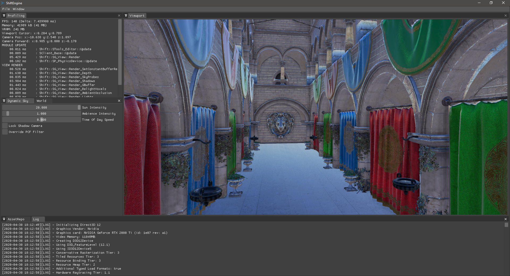
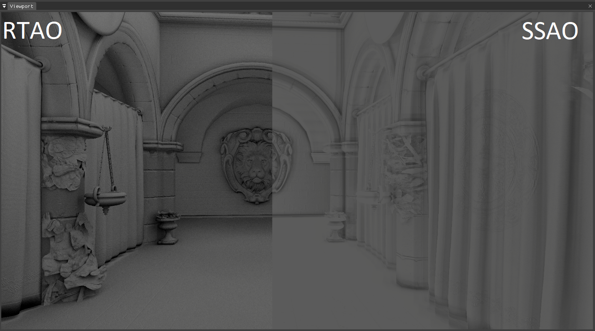

# Shift Engine

## About

Shift Engine is an experimental game-engine built to enable content creators to fully visualize their ideas.
The foundation of the engine is based upon a strong platform of modern technologies and widely used solutions.

The engine is currently focusing on support for Windows OS and thus multi-os support is limited. However the plan is to make the project available on several other platforms as well, such as Linux, Android and Mac.

## Goal & Features

The goal is to develop an engine with focus on cutting-edge technology and graphical features to enable content-creators to fully visualize their ideas.
With this in mind the engine will be mainly developed by the latest graphical technologies available.

Another goal is to target the engine at 100% runtime. I.e minimize bake to a point where you basically have no baking at all.
The reasoning for this is improvements for development iteration times and also to keep disk footprint as small as possible.
In an actual live game this would also mean, smaller download sizes for patches etc.

API-support:
* DirectX 12 (Windows only)
* Vulkan (Windows & Linux)

Graphical features & goals:
* Lighting-model based on raytracing
* Raytraced Global Illumination
* Raytraced Shadows
* ~~Raytraced Ambient Occlusion~~ ✓
* Raytraced Reflections & Refractions
* Volumetric effects (Fog, Lighting etc.)
* Advanced terrain rendering using Adaptive Tesselation
* Temporal Anti-aliasing
* Fallbacks for certain effects (Screen-space Reflections, Subsurface-scattering, Voxel-based Global Illumination)
* Post-processing stack (HDR-tonemapping, Bloom, Color Correction, Post-process Anti-aliasing, Motion Blur, Chromatic Abberation)
* Custom material-shading support
* Dynamic environment (Sky & Sun based on time, weather-effects such as rain, snow, wind, sandstorms etc.)

Performance features & goals:
* ~~Scalable multithreaded task-based environment~~ ✓
* Scalable feature settings depending on hardware
* ~~Tile-based Deferred & Forward passes~~ ✓
* ~~Custom file-formats for faster I/O~~ ✓
* Custom profiler (CPU & GPU)

I/O-support:
* ~~Multiple 3D-model file-type support (.fbx, .obj, .3ds etc.)~~ ✓
* ~~Multiple Texture file-type support (.dds, .bmp , .jpeg , .png , .tiff , .gif)~~ ✓
* Custom file compression

Tool Features
* GUI Editor directly linked to the engine.
* Node-graph system

## Contact

* Hampus Siversson (Author)
  - Rendering Engineer
  - [LinkedIn](https://www.linkedin.com/in/hampus-siversson/)

